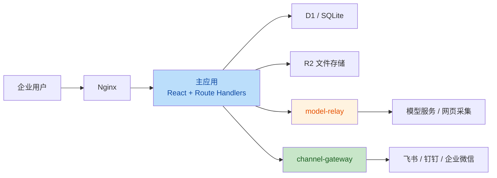

# 海芯 AI 项目技术评审与改进清单

## 1. 项目概况

这是一个企业 AI 工作台的模块化单体，覆盖聊天/RAG、企业与个人知识库、智能体、可审批工作流、数据采集、合同/监控、组织权限、模型接入，以及飞书、钉钉、企业微信机器人。

### 技术组合

- 前端：React 19、Next 16、TypeScript、Tailwind CSS、Vinext/Vite
- 后端：Route Handler、Cloudflare Workers、D1/SQLite、Drizzle、R2
- 独立服务：
  - `model-relay`：模型请求与网页采集代理
  - `channel-gateway`：飞书、钉钉、企业微信长连接
- 部署：Docker Compose、Nginx、Node.js 22

### 系统拓扑



## 2. 项目优势

- 产品闭环完整：不是简单聊天页面，已覆盖知识、智能体、工作流、审批、采集和外部平台接入。
- 工作流设计较扎实：运行、步骤、输入输出、错误和审批状态都有持久化；审批后可以从节点继续执行，而不是全量重跑。
- 知识权限不是只靠前端隐藏：企业知识在列表、对话检索、下载等环节均有后端控制。
- 长连接网关独立部署：飞书、钉钉、企业微信的常驻连接没有塞入无状态 Web 路由，边界合理。
- 模型调用集中适配：避免业务路由重复兼容不同响应格式。
- TypeScript 已开启严格模式，主要项目和独立服务均有依赖锁文件。

# 3. 改进清单

## P0：上线前必须解决

| 项目 | 风险 | 建议 |
|---|---|---|
| 移除 Nginx 固定身份 | Nginx 为所有用户写入同一个 `oai-authenticated-user-email`，应用又优先信任该请求头。所有人可能被识别为同一账号，导致审计、审批、个人知识和会话隔离失效。 | 删除固定身份头；自托管模式使用会话 Cookie。若接入统一身份认证，必须由可信代理按真实用户动态签发身份，并校验代理来源或签名。 |
| 关闭验证码回显与注册覆盖密码 | 未配置 SMTP 时接口返回 `debugCode`；验证成功后可通过 `ON CONFLICT DO UPDATE` 覆盖已有账户密码。 | 生产环境禁止回显验证码；注册拒绝已存在邮箱；单独实现密码找回流程；加入频率限制、尝试次数和安全审计。 |
| 修复 SSRF | 数据采集代理只检查 HTTP/HTTPS，没有拦截 localhost、私网地址、Docker 服务和云元数据地址。 | DNS 解析后拒绝回环、私网、链路本地和保留地址；每次重定向后重新校验；采集服务使用受限网络；高风险采集能力不应默认开放。 |
| 删除 TLS 校验降级 | 模型或采集目标证书失败后会使用 `rejectUnauthorized: false` 重试，模型调用仍然携带 API Key 和业务数据。 | 证书失败必须安全终止；私有 CA 应显式导入信任链，不能关闭 TLS 验证。 |
| 禁止默认生产密钥和密码 | Compose 中存在公开默认平台密钥、网关密钥，安装流程也存在默认管理员密码。 | 缺失生产密钥时启动失败；安装阶段生成高熵随机值；首次登录强制改密；轮换已有环境中的默认密钥和平台凭证。 |
| 修复采集结果越权发布 | 采集运行列表可能全局返回，发布时仅按 `runId` 查询，未验证运行所有者，并且可以写入企业知识库。 | 所有读取和更新附带 `actor` 条件；管理员例外显式处理；企业知识发布设置独立权限或审批。 |

## P1：下一阶段优先处理

| 项目 | 现状 | 建议 |
|---|---|---|
| 数据库迁移统一 | 同时存在 Drizzle Schema、SQL Migration 和路由内 `CREATE TABLE`；认证热路径还会执行建表和全表数据规范化。 | 以版本化 Migration 为唯一数据库事实来源；移除请求链路中的建表与全表修复；补全 Schema；CI 验证空库和升级库迁移。 |
| 修复迁移执行机制 | 自托管入口只使用 `.migrations-applied` 文件标记，第一次启动后新增迁移可能永远不会执行。 | 建立数据库迁移历史表，逐条记录迁移名称、校验和和执行时间。 |
| 服务端授权闭环 | 权限中心定义了能力项，但部分模型和平台连接 API 只做身份认证，没有执行能力授权。 | 建立“HTTP 方法 + API 路径 + 领域动作 → capability”映射；敏感写操作统一强制调用能力授权。 |
| 密码存储升级 | 当前使用单轮 `SHA-256(salt:password)`。 | 使用 Argon2id；如 Worker 环境受限，则采用高迭代 PBKDF2；增加算法版本，旧密码登录后渐进升级。 |
| 会话安全 | Cookie 未设置 `Secure`，部署默认只开放 HTTP。 | 生产只允许 HTTPS；Cookie 设置 `Secure; HttpOnly; SameSite=Lax/Strict`；改密后撤销其他会话。 |
| 审批幂等与事务 | 审批流程采用先查询后更新，审批状态、工作流续跑和审计分多条语句执行。 | 使用 `UPDATE ... WHERE status='待审批'` 原子抢占并检查受影响行数；使用事务或批处理；工作流续跑增加幂等键。 |
| 敏感配置管理 | SMTP 凭证与普通设置混存，与平台和模型凭证的加密策略不一致。 | 建立统一 Credential Vault，支持加密、脱敏读取、密钥版本和轮换。 |

## P2：可维护性、性能与源码规范

### 3.1 按领域拆分巨型模块

当前主要复杂度集中在：

- `app/Console.tsx`：集中承载导航、状态、数据加载和多个领域操作。
- `app/FeaturePanels.tsx`：包含大量功能面板以及历史、禁用或损坏组件。
- `app/api/modules/route.ts`：智能体、工作流、采集、发布、审计和 Schema 初始化混在一个路由。

建议按领域拆分：

```text
domain/
  identity/
  governance/
  knowledge/
  conversations/
  agents/
  workflows/
  collection/

application/
  chat-service.ts
  workflow-service.ts
  collection-service.ts
  approval-service.ts

infrastructure/
  db/
  models/
  storage/
  platforms/
```

Route Handler 应只负责：输入验证、服务调用、响应映射。业务编排、数据库事务和外部服务调用应放入领域服务或应用服务。

### 3.2 前端模块与状态管理

不需要立即引入 Redux。优先按照业务功能拆分页面、组件和 hooks：

```text
features/
  chat/
  knowledge/
  workflows/
  agents/
  collection/
  governance/
```

建议：

- 将各模块的数据加载、变更和错误状态收敛到对应 feature。
- 避免控制台初始化时一次性请求全部领域数据。
- 页面切换时按需加载。
- 删除已经确认无用的 Legacy、Broken、Disabled 组件，而不是长期保留在生产源码中。
- API 请求统一封装错误解析、取消请求和加载状态。

### 3.3 数据模型一致性

优先统一以下核心表：

- `org_members`
- `role_permissions`
- `approval_requests`
- `data_sources`
- `data_collection_runs`

要求：

- 字段命名和含义在 Schema、Migration、SQL 查询中保持一致。
- 关键关联建立外键或明确的应用级删除策略。
- 为会话 Token、用户邮箱、运行所有者等高频条件建立索引。
- 禁止 Schema 不匹配时静默返回空数据，应记录错误并阻止错误版本启动。

### 3.4 模型供应商策略

当前 UI 展示多种模型供应商，但底层实际强绑定固定中转端点。建议明确支持：

1. 固定企业中转；
2. OpenAI-compatible 自定义端点；
3. 直连特定供应商。

同时增加：

- 允许域名列表；
- 请求超时；
- 有限制的安全重试；
- 熔断和降级；
- 模型级失败率和耗时监控；
- 文本模型与图片模型独立协议适配。

### 3.5 异常处理和日志规范

当前存在较多 `.catch(() => undefined)`、`.catch(() => null)` 和空 `catch`，容易把数据库或 Schema 错误误判成“没有数据”。

建议：

- 只对明确可接受的错误进行降级。
- 数据库结构错误必须记录并阻止错误版本运行。
- 对外返回稳定错误码，不直接透传底层 DNS、TLS 和数据库异常。
- 统一结构化日志字段：`requestId`、`actor`、`module`、`action`、`duration`、`errorCode`。

### 3.6 可观测性

建议补齐：

- Request ID / Trace ID；
- 模型调用耗时、Token、供应商、错误率；
- 网关连接状态、重连次数、重复事件数；
- 数据采集目标域名、阻断次数和拒绝原因；
- 工作流成功率、失败节点和平均执行时长；
- 审批时长；
- 企业知识检索命中率。

### 3.7 性能

优先处理：

- 移除认证请求中的动态建表、全表扫描和逐行更新。
- 首页和控制台按模块懒加载数据。
- 为用户、会话、运行记录和所有者字段补索引。
- 对模型中转请求体设置大小上限。
- 企业知识检索后续应考虑全文索引或向量检索，不应长期依赖大范围字符串扫描。

# 4. 测试与 CI 清单

当前自动化测试仍包含模板项目内容断言，与企业 AI 平台业务脱节。建议按以下顺序补充。

## 4.1 身份与权限测试

- Cookie 和可信身份头的优先级。
- 管理员、普通员工的 API 授权矩阵。
- 禁用用户无法继续使用现有会话。
- 模型管理和平台接入权限必须在服务端生效。

## 4.2 数据隔离测试

- 对话跨用户访问。
- 个人知识跨用户访问。
- 工作流运行记录跨用户访问。
- 数据采集运行记录跨用户访问。
- 部门知识检索和文件下载权限。

## 4.3 安全测试

- SSRF：localhost、私网、Docker 服务名、云元数据地址和重定向。
- 注册流程不能覆盖已有账户密码。
- 生产模式不能返回验证码。
- 默认密钥缺失时容器启动失败。
- TLS 证书失败时不能降级继续请求。

## 4.4 工作流测试

- 审批节点暂停。
- 审批通过后从正确节点续跑。
- 审批拒绝后终止工作流。
- 并发审批只有一次能够成功。
- 重复平台事件和重复续跑不会产生重复副作用。

## 4.5 数据库测试

- 空数据库执行全部迁移。
- 旧版本数据库升级到新版本。
- 迁移失败后不能标记成功。
- Schema 与生产查询字段保持一致。

## 4.6 最小 CI 门禁

```text
npm ci
npm run lint
npx tsc --noEmit
npm test
Docker 镜像构建
空库和旧库迁移测试
依赖漏洞扫描
Secret 扫描
```

# 5. 建议实施顺序

1. 安全止血：固定身份、验证码回显、SSRF、TLS 降级、默认密钥和采集越权。
2. 稳定数据和权限：迁移机制、统一 Schema、服务端能力授权、审批幂等。
3. 建立测试护栏：先覆盖安全路径、身份权限和核心工作流，再接入 CI。
4. 模块化重构：优先拆分 `modules/route.ts`，再拆分 `Console.tsx` 和 `FeaturePanels.tsx`。
5. 补可观测性和性能：移除鉴权热路径中的建表及全表扫描，加入追踪、指标和告警。
6. 再扩展新功能：身份、数据模型、授权边界和测试体系稳定后，再继续横向增加功能模块。

# 6. 总体评价

项目已经具备较强的企业 AI 产品雏形和合理的私有化部署方向，尤其是企业知识、智能体、工作流审批、数据采集和三方平台连接已经形成业务闭环。

当前限制项目继续演进的主要因素不是功能数量，而是：

- 生产安全债务；
- 数据库存在多个事实来源；
- 服务端授权不完全一致；
- 核心模块体积过大；
- 自动化测试和 CI 基线不足。

建议在身份、数据模型、授权边界和测试体系稳定之前，暂停横向增加新模块，优先完成 P0 和 P1 清单。